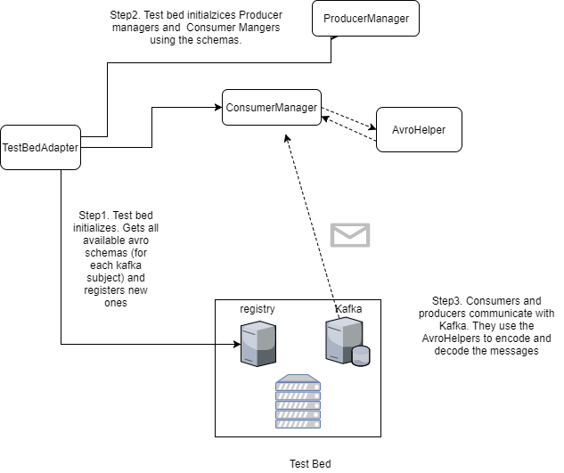

# Structure

The basic structure of this project imitates the instance of test bed adapted for nodejs  [node-test-bed-adapter](https://github.com/DRIVER-EU/node-test-bed-adapter)

This is the diagram of the classes that will explain in more detail:

## The class TestBedAdapter

``TestBedAdapter`` located in  _(test_bed_adapter/__init__.py)_ is the main class of the test bed adapter.
This class orchestrates the calls to registry, the registration of new schemas, and the initializations
of the consumers and producers. In the function ``TestBedAdapter.initialize`` is where this orchestration happens.

Once an instance of ``TestBedAdapter`` is initialized, the the attributes ``TestBedAdapter.producer_managers`` 
and ``TestBedAdapter.consumer_managers`` will contain dictionaries with all the initialized consumers and 
producers that can later be used to receive and send messages.

The options for the ``TestBedAdapter`` initalization will be an instance of the class ``TestBedOptions`` (_test_bed_adapter/options/test_bed_options.py_). To see the default options check the commentaries
in _test_bed_adapter/options/test_bed_options.py_.

## Consumers and producers
By consumers and Producers we mean instances of the classes ``ConsumerManager`` and ``ProducerManager`` 
(located in _test_bed_adapter/kafka/consumer_manager.py_ and _test_bed_adapter/kafka/produced_manager.py_).
They are wrappers around the class ``KafkaClient`` of the __pykafka__ library. Consumers and producers are the way in which we communicate with the test bed.

## Avro
The Test Bed Adapter uses avro to encode the messages before passing them through Kafka. The class that encodes the messages 
is ``AvroSchemaHelper`` (_test_bed_adapter/utils/avro_schema_helper.py_). This class uses the library [avro-python3](https://pypi.org/project/avro-python3/) to achieve this purpose.

## Examples
A set of examples is provided in _/examples_. For instance to the consumer example just go to the examples folder and run ``python consumer_example.py``. If an instance of test bed is running
in localhost you will see how messages are recieved.

## Tests
A set of tests made with _unittest_ is provided in the folder _/tests_. To run then add the test folder to your PYTHONPATH variable and run
``python -m unittest``. To run then with pycharm click on the test folder and right click _run unittests in test_. The unit tests
cover the consumers, adapters, heartbeat, schema publisher and schema registry. Recall that some of the unit test need
messages registered in kafka so they may not pass the first time you run them.

## Building and uploading to pip
To upload a new version to pip run the script ``upload_pip.cmd`` if you are on windows or ``upload_pip.sh`` from linux. Remember to change the version number
in _setup.py_

